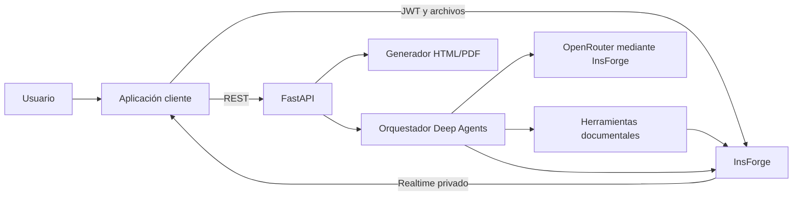
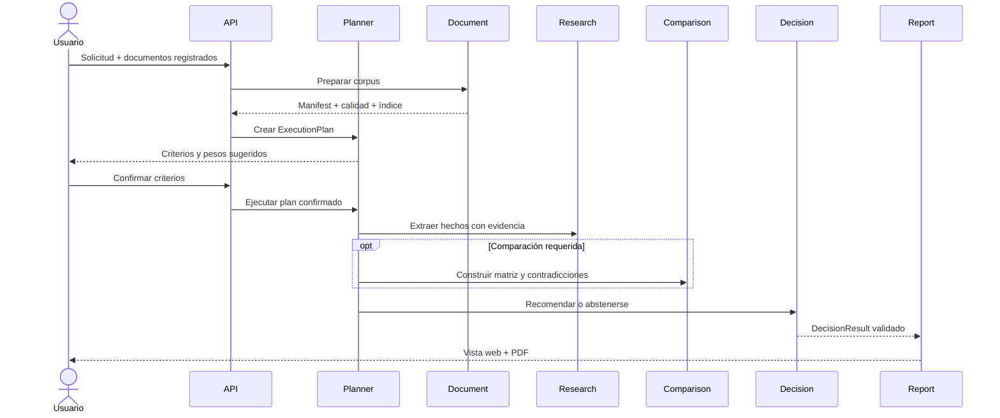
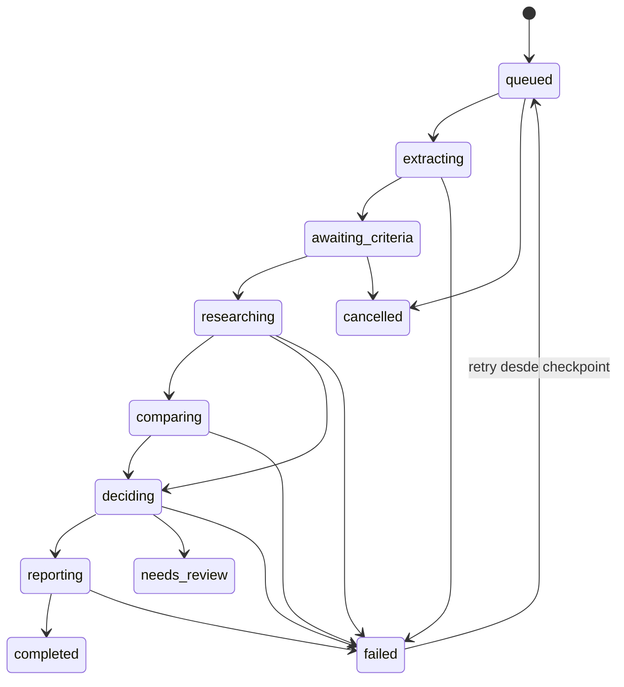

# Arquitectura técnica de Aristóteles

## Decisión

Aristóteles usará un orquestador Python basado en Deep Agents con cinco agentes especializados. InsForge proporcionará identidad, almacenamiento, datos, vectores, modelos y eventos. Las operaciones que necesitan reproducibilidad permanecerán como herramientas deterministas.

Esta separación es esencial: un agente decide **qué herramienta utilizar**; la herramienta garantiza **cómo se ejecuta y valida** la operación.

## Contexto



## Despliegue

| Componente | Tecnología | Responsabilidad |
|---|---|---|
| API y worker | Python 3.12, FastAPI | Contratos REST, autenticación, trabajos y health checks |
| Orquestación | Deep Agents sobre LangGraph/LangChain | Planificación, subagentes, checkpoints y herramientas |
| Validación | Pydantic | Contratos de entrada, salida y eventos |
| Extracción | PyMuPDF, pdfplumber | Texto, páginas, tablas y renderizado |
| OCR local | Tesseract con idioma español | Imágenes y páginas escaneadas |
| OCR fallback | Modelo visual configurable por OpenRouter | Páginas bajo el umbral de calidad |
| PDF | Plantilla HTML y WeasyPrint | Reporte reproducible |
| Backend gestionado | InsForge | Auth, Storage, Postgres, pgvector, AI y Realtime |
| Observabilidad | Logs estructurados, métricas y LangSmith | Duración, errores, costo y calidad |

La imagen OCI se desplegará primero en InsForge Compute. Como Compute está sujeto a habilitación por proyecto, la misma imagen podrá ejecutarse temporalmente en otro proveedor sin cambiar contratos ni datos.

## Límites del sistema

### Cliente

- Inicia sesión con InsForge Auth.
- Carga archivos directamente a Storage privado.
- Consume REST con el JWT del usuario.
- Se suscribe al canal privado de la ejecución.
- Renderiza resultados; no llama modelos ni usa credenciales administrativas.

### API

- Valida JWT, ownership y contratos.
- Registra archivos ya cargados.
- Crea planes y ejecuciones.
- Expone resultados y enlaces firmados.
- No ejecuta procesamiento largo dentro de la solicitud HTTP.

### Worker

- Reclama tareas pendientes de forma atómica.
- Persiste checkpoints por etapa.
- Ejecuta agentes y herramientas con límites.
- Publica estados sanitizados.
- Usa credenciales server-side y filtra toda operación por `owner_id`, `case_id` y `run_id`.

## Orquestación



### Despacho adaptativo

- `Document` prepara siempre el corpus antes del análisis.
- `Planner` puede activar u omitir `Research` y `Comparison` según el objetivo.
- `Decision` participa cuando se solicita una recomendación.
- El plan registra la justificación de cada agente activado u omitido.
- Ningún subagente puede delegar tareas fuera de su catálogo permitido.

## Contratos de dominio

Los siguientes tipos son contratos públicos entre API, agentes, persistencia y pruebas.

### ExecutionPlan

```json
{
  "objective": "Seleccionar proveedor",
  "tasks": [{ "agent": "research", "goal": "Extraer condiciones" }],
  "suggested_criteria": [{ "key": "price", "label": "Precio", "weight": 0.3 }],
  "required_document_ids": ["uuid"],
  "status": "awaiting_criteria"
}
```

### EvidenceRef

```json
{
  "id": "uuid",
  "claim": "La garantía es de 24 meses",
  "document_id": "uuid",
  "page": 8,
  "chunk_id": "uuid",
  "quote": "Garantía de 24 meses",
  "source_hash": "sha256:..."
}
```

### ProviderComparison

```json
{
  "provider_id": "provider-b",
  "criteria": [{
    "key": "warranty",
    "value": "24 meses",
    "normalized_score": 0.9,
    "evidence_ids": ["uuid"],
    "missing": false
  }],
  "advantages": [],
  "disadvantages": [],
  "contradictions": []
}
```

### DecisionResult

```json
{
  "outcome": "recommendation",
  "recommended_provider_id": "provider-b",
  "summary": "Proveedor B presenta menor riesgo total.",
  "risk_items": [],
  "evidence_ids": ["uuid"],
  "confidence": {
    "score": 0.82,
    "band": "high",
    "coverage": 0.9,
    "citation_support": 0.85,
    "consistency": 0.75,
    "extraction_quality": 0.8
  }
}
```

`outcome` admite `recommendation` o `needs_review`. Si es `needs_review`, `recommended_provider_id` debe ser `null` y el resultado debe explicar qué información falta o se contradice.

### ProgressEvent

```json
{
  "sequence": 12,
  "run_id": "uuid",
  "stage": "comparing",
  "status": "running",
  "progress": 0.65,
  "message": "Comparando garantías y plazos",
  "occurred_at": "2026-07-15T12:00:00Z"
}
```

Los eventos nunca incluyen contenido documental, prompts, secretos ni razonamiento privado.

## API REST

Todos los endpoints usan `/v1`, JSON y JWT de InsForge salvo la descarga mediante URL firmada.

| Método y ruta | Resultado |
|---|---|
| `POST /v1/cases` | Crea un expediente |
| `GET /v1/cases/{case_id}` | Devuelve expediente y estados resumidos |
| `POST /v1/cases/{case_id}/documents` | Registra un objeto privado ya cargado |
| `DELETE /v1/cases/{case_id}/documents/{document_id}` | Elimina documento y derivados |
| `POST /v1/cases/{case_id}/plans` | Prepara corpus y crea plan preliminar |
| `PUT /v1/plans/{plan_id}/criteria` | Confirma criterios cuyos pesos suman `1.0` |
| `POST /v1/plans/{plan_id}/runs` | Inicia una ejecución asíncrona idempotente |
| `GET /v1/runs/{run_id}` | Devuelve estado, etapas y errores seguros |
| `POST /v1/runs/{run_id}/retry` | Reanuda desde la última etapa válida |
| `GET /v1/runs/{run_id}/report` | Devuelve reporte web estructurado |
| `GET /v1/reports/{report_id}/pdf` | Devuelve una URL firmada y temporal |
| `DELETE /v1/cases/{case_id}` | Elimina expediente y todos sus artefactos |

Las operaciones de creación aceptan `Idempotency-Key`. Repetir la misma clave con el mismo cuerpo devuelve el recurso previo; reutilizarla con otro cuerpo produce conflicto.

## Persistencia

### Tablas públicas

| Tabla | Contenido |
|---|---|
| `cases` | Expediente, objetivo y propietario |
| `documents` | Metadatos, hash, clave y estado del archivo |
| `document_pages` | Texto, método y calidad de extracción |
| `chunks` | Texto, posición, metadatos, modelo y vector |
| `analysis_criteria` | Criterios, pesos y confirmación |
| `analysis_runs` | Estado, versión de configuración y checkpoint |
| `agent_tasks` | Agente, estado, intentos, tiempos y error seguro |
| `evidence` | Afirmación y localización verificable |
| `comparisons` | Matriz validada por proveedor |
| `decisions` | Recomendación, riesgos y confianza |
| `reports` | Snapshot estructurado y clave del PDF |

Todas incluyen `owner_id`; las entidades dependientes incluyen también las claves de expediente o ejecución necesarias para filtros e integridad. Las relaciones usan eliminación en cascada cuando el artefacto no tiene sentido sin su padre.

### Storage

Buckets privados separados:

- `case-documents`: `{owner_id}/{case_id}/{document_id}/{filename}`
- `case-reports`: `{owner_id}/{case_id}/{report_id}/report.pdf`

Se persisten `url` y `key`, pero las operaciones de acceso y borrado usan `key`. Las políticas de `storage.objects` validan usuario y prefijo.

### Vectores

- Extensión `vector` y distancia coseno.
- Índice HNSW con `vector_cosine_ops`.
- Índices B-tree por `owner_id`, `case_id`, `document_id` y página.
- RPC de búsqueda `SECURITY INVOKER` cuando actúa con JWT.
- Procesos administrativos deben filtrar internamente por propietario y expediente.
- Un modelo y dimensión por columna; migrar implica nueva columna o tabla y re-embedding.

La recuperación combina similitud semántica, filtros de metadatos, contexto vecino y reranking configurable. Los umbrales se calibran con el dataset dorado, no por intuición.

## Estado y recuperación



Cada etapa escribe su resultado validado antes de publicar el siguiente estado. Un worker reclama tareas mediante transición atómica para impedir doble ejecución. Los errores transitorios usan backoff y un número máximo de intentos; los definitivos conservan un código seguro y la etapa recuperable.

## Seguridad

- RLS en todas las tablas de aplicación, con `USING` y `WITH CHECK` por `auth.uid()`.
- Privilegios SQL explícitos además de las políticas.
- Storage RLS para lectura, inserción, actualización y eliminación.
- Validación de MIME real, tamaño, hash y ownership antes de procesar.
- Contenido documental delimitado como datos; nunca se incorpora como instrucciones del sistema.
- Herramientas allowlist por agente y argumentos validados.
- Secrets administrados por InsForge y nunca expuestos al cliente.
- Workers con acceso administrativo usan repositorios centralizados que exigen `owner_id`, `case_id` y `run_id`.
- Reportes escapan contenido y solo citan fragmentos aprobados por el contrato.
- Borrado del expediente elimina filas, objetos de Storage y tareas pendientes.

## Observabilidad

Cada ejecución registra:

- correlación por `run_id`, `task_id` y `document_id`;
- duración, intentos, tokens y costo por agente/modelo;
- cantidad de páginas, calidad OCR y uso de fallback;
- chunks recuperados, puntuaciones y citas aceptadas;
- transiciones, errores seguros y motivo de abstención.

LangSmith se usa para evaluación y trazas de agentes con redacción de contenido sensible. Los logs operativos no almacenan documentos, prompts completos, tokens de acceso ni secretos.

## Estrategia de pruebas

### Unitarias

- Parsing, calidad OCR, chunking y contexto vecino.
- Validación de contratos y pesos.
- Cálculo de confianza y límites por contradicción.
- Idempotencia, transiciones y generación HTML/PDF.

### Integración

- RLS de tablas y Storage con dos usuarios.
- RPC vectorial filtrada por expediente.
- Eventos Realtime privados y ordenados por secuencia.
- Reintentos de modelos, fallback OCR y checkpoints.
- Eliminación coordinada de base de datos y Storage.

### Evaluación RAG y agentes

- Dataset dorado con proveedores, hechos, páginas y citas esperadas.
- Recall de evidencia, precisión de citas y cobertura de criterios.
- Detección de afirmaciones sin respaldo y datos inventados.
- Contradicciones, documentos incompletos e instrucciones maliciosas embebidas.
- Repetibilidad de comparación con criterios y pesos idénticos.

### End-to-end

1. Dos usuarios cargan expedientes independientes.
2. El Planner propone y recibe criterios confirmados.
3. Una ejecución se interrumpe y reanuda.
4. El resultado cita las páginas correctas y genera web/PDF equivalentes.
5. Un usuario intenta acceder al expediente del otro y recibe denegación.
6. El expediente se elimina sin dejar originales ni derivados.

## Secuencia de implementación

1. Aprovisionar el proyecto InsForge dedicado y configurar secretos.
2. Crear migraciones, buckets, RLS, RPC vectorial y canales Realtime.
3. Implementar API, autenticación y persistencia de trabajos.
4. Construir herramientas documentales y evaluación de retrieval.
5. Incorporar agentes y contratos uno por uno.
6. Añadir decisión, reporte y trazabilidad.
7. Validar con dataset dorado y pruebas de aislamiento.
8. Desplegar la imagen OCI en Compute o en el fallback temporal.
