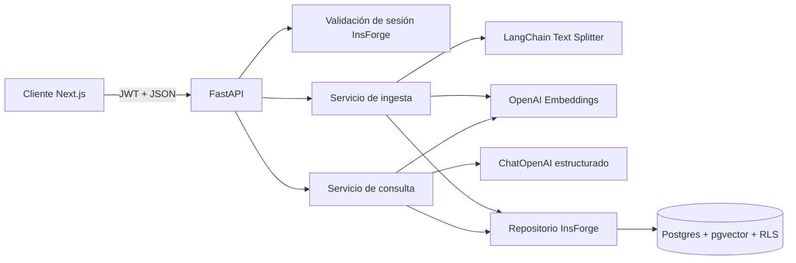

# Diseño: núcleo RAG con LangChain, OpenAI e InsForge

Fecha: 2026-07-15

Estado: diseño conversacional aprobado; pendiente de revisión del usuario.

## Contexto

Aristóteles tiene un frontend Next.js y una arquitectura objetivo para analizar documentos con evidencia trazable, pero todavía no tiene backend. La documentación actual propone Python/FastAPI, InsForge y modelos servidos mediante OpenRouter.

Esta entrega crea el primer corte vertical del RAG. Mantiene InsForge para identidad, Postgres y `pgvector`, pero usa la API de OpenAI directamente para embeddings y generación. LangChain coordina el procesamiento de texto y las llamadas a OpenAI sin asumir todavía la orquestación multiagente del producto completo.

La implementación deberá actualizar las referencias a OpenRouter en `README.md`, `docs/PRD.md` y `docs/ARCHITECTURE.md` cuando describan este flujo.

## Decisiones

- Backend separado en Python 3.12 y FastAPI bajo `backend/`.
- LangChain para partición de texto, embeddings, prompts y salida estructurada.
- SDK oficial de OpenAI mediante `langchain-openai`.
- OpenAI directo, no InsForge Model Gateway, para chat y embeddings.
- InsForge REST/RPC como acceso a Postgres y `pgvector`.
- Adaptador propio para InsForge; el dominio no dependerá de detalles HTTP.
- JWT de InsForge reenviado en cada operación de datos para que RLS sea la barrera de seguridad.
- Embeddings `text-embedding-3-small` de 1536 dimensiones.
- Modelo de chat configurable, con `gpt-4.1-mini` como valor inicial.
- Entrada inicial de texto ya extraído y separado por páginas. PDF, imágenes y OCR quedan para otra entrega.

## Objetivos

- Crear un expediente privado.
- Registrar e indexar texto ya extraído de un documento.
- Dividir cada página en chunks reproducibles y generar embeddings por lotes.
- Recuperar chunks únicamente del usuario y expediente solicitados.
- Responder con OpenAI usando solo el contexto recuperado.
- Devolver citas verificables con documento, página, chunk, fragmento y puntuación.
- Abstenerse de responder cuando el contexto sea insuficiente.
- Proporcionar migración, configuración y guía para conectar un proyecto InsForge futuro.
- Probar localmente la lógica mediante adaptadores falsos, sin credenciales reales.

## Fuera De Alcance

- Carga binaria, parsing de PDF, imágenes y OCR.
- Almacenamiento de archivos originales.
- Recuperación híbrida, reranking o expansión de contexto vecino.
- Agentes Planner, Research, Comparison y Decision.
- Jobs asíncronos, checkpoints y eventos Realtime.
- Interfaz de usuario para el RAG.
- Reporte web o PDF.
- Aprovisionar una cuenta o un proyecto InsForge desde esta entrega.

## Arquitectura



El servicio se divide en límites pequeños:

- API: HTTP, autenticación, validación y traducción de errores.
- Dominio: contratos de expediente, documento, chunk, consulta, respuesta y cita.
- Ingesta: normalización, hash, chunking, batching e indexación.
- Recuperación: embedding de consulta y búsqueda vectorial filtrada.
- Generación: prompt, salida estructurada y validación de citas.
- Repositorio: operaciones REST/RPC de InsForge.
- Proveedores: construcción de `OpenAIEmbeddings` y `ChatOpenAI`.

## Estructura Propuesta

```text
backend/
  pyproject.toml
  .env.example
  README.md
  src/aristoteles_api/
    main.py
    api/
      dependencies.py
      errors.py
      routes/
        cases.py
        documents.py
        questions.py
    core/
      config.py
      logging.py
    domain/
      models.py
      ports.py
    rag/
      chunking.py
      prompts.py
      ingestion.py
      retrieval.py
      generation.py
    infrastructure/
      insforge.py
      openai.py
  tests/
    unit/
    api/
    integration/
migrations/
  20260715000000_create_rag_core.sql
```

`domain/ports.py` definirá protocolos para sesión, repositorio vectorial, embeddings y generación. Las pruebas sustituirán estos puertos sin realizar solicitudes externas.

## API

Todas las rutas salvo salud requieren `Authorization: Bearer <insforge-jwt>`. La API validará el token mediante `GET /api/auth/sessions/current` y rechazará tokens expirados o sesiones administrativas.

### Salud

`GET /health`

No consulta proveedores externos. Responde `200` mientras el proceso pueda atender solicitudes.

```json
{
  "status": "ok"
}
```

### Crear Expediente

`POST /v1/cases`

```json
{
  "objective": "Comparar las garantías de los proveedores"
}
```

Respuesta `201`:

```json
{
  "id": "uuid",
  "objective": "Comparar las garantías de los proveedores",
  "created_at": "2026-07-15T12:00:00Z"
}
```

El propietario se obtiene de la sesión; nunca se acepta en el cuerpo.

### Indexar Texto

`POST /v1/cases/{case_id}/documents/text`

```json
{
  "name": "cotizacion-proveedor-a.pdf",
  "pages": [
    {"page": 1, "text": "Contenido extraído de la primera página."},
    {"page": 2, "text": "Contenido extraído de la segunda página."}
  ]
}
```

Respuesta `201` para una indexación nueva o `200` si la misma entrada normalizada ya estaba indexada:

```json
{
  "document_id": "uuid",
  "status": "indexed",
  "chunk_count": 8,
  "source_hash": "sha256:...",
  "already_indexed": false
}
```

El hash se calcula sobre nombre y páginas normalizados. Una restricción única por propietario, expediente, hash y modelo de embedding hace idempotente la repetición exacta.

### Consultar Expediente

`POST /v1/cases/{case_id}/questions`

```json
{
  "question": "¿Cuánto dura la garantía del proveedor A?",
  "top_k": 5
}
```

Respuesta `200` con evidencia:

```json
{
  "status": "answered",
  "answer": "La garantía indicada es de 24 meses [S1].",
  "citations": [
    {
      "source_id": "S1",
      "chunk_id": "uuid",
      "document_id": "uuid",
      "document_name": "cotizacion-proveedor-a.pdf",
      "page": 2,
      "quote": "Garantía de 24 meses...",
      "similarity": 0.87
    }
  ]
}
```

Respuesta `200` sin contexto suficiente:

```json
{
  "status": "insufficient_context",
  "answer": "No hay evidencia suficiente en los documentos del expediente.",
  "citations": []
}
```

`top_k` tendrá valor predeterminado `5` y rango permitido de `1` a `10`.

## Modelo De Datos

### `cases`

- `id uuid primary key`
- `owner_id uuid not null default auth.uid()`
- `objective text not null`
- `created_at timestamptz not null default now()`
- restricción única `(owner_id, id)` para claves foráneas compuestas

### `documents`

- `id uuid primary key`
- `owner_id uuid not null default auth.uid()`
- `case_id uuid not null`
- `name text not null`
- `source_hash text not null`
- `embedding_model text not null`
- `status text not null` limitado a `indexing`, `indexed` o `failed`
- `chunk_count integer not null default 0`
- `created_at timestamptz not null default now()`
- clave foránea `(owner_id, case_id)` hacia `cases`
- restricción única `(owner_id, case_id, id)` para la clave foránea de chunks
- restricción única `(owner_id, case_id, source_hash, embedding_model)`

### `chunks`

- `id uuid primary key`
- `owner_id uuid not null default auth.uid()`
- `case_id uuid not null`
- `document_id uuid not null`
- `page integer not null`
- `chunk_index integer not null`
- `content text not null`
- `content_hash text not null`
- `token_count integer not null`
- `embedding_model text not null`
- `embedding vector(1536) not null`
- `created_at timestamptz not null default now()`
- clave foránea compuesta hacia `documents`
- restricción única `(document_id, chunk_index, embedding_model)`

La migración habilitará `vector`, índices B-tree para propiedad y expediente, y un índice HNSW con `vector_cosine_ops` para embeddings.

## Búsqueda Vectorial

La migración expondrá `match_case_chunks` como función `SECURITY INVOKER`. Recibirá:

- `query_case_id uuid`
- `query_embedding vector(1536)`
- `query_embedding_model text`
- `match_count integer`
- `match_threshold double precision`

La función filtrará explícitamente por `owner_id = auth.uid()`, `case_id = query_case_id`, `embedding_model = query_embedding_model` y documentos con estado `indexed`. Ordenará por distancia coseno y limitará internamente `match_count` a un máximo de `10`.

El umbral inicial será configurable mediante `RAG_MIN_SIMILARITY`, con valor local `0.20`. Este valor es operativo, no una garantía de calidad, y deberá calibrarse con el dataset dorado antes de producción.

## Ingesta

1. Validar sesión, propiedad del expediente, nombre, páginas y límites.
2. Normalizar finales de línea y espacios sin alterar el contenido semántico.
3. Calcular el hash canónico del documento.
4. Devolver el documento existente si ya está `indexed` con el mismo hash y modelo.
5. Crear o reclamar el documento con estado `indexing`.
6. Dividir cada página por separado con `RecursiveCharacterTextSplitter.from_tiktoken_encoder`.
7. Usar chunks de 700 tokens y solapamiento de 100 tokens.
8. Generar embeddings en lotes de hasta 64 chunks mediante `OpenAIEmbeddings`.
9. Insertar chunks por lotes conservando página, posición, hashes y modelo.
10. Marcar el documento `indexed` con el total de chunks.

Si una operación falla después de crear el documento, se marca `failed`. Un nuevo intento elimina los chunks parciales de ese documento y reinicia la indexación. La búsqueda nunca incluye documentos que no estén `indexed`.

No se mezclan páginas dentro de un chunk para mantener citas inequívocas.

## Consulta Y Generación

1. Validar sesión, propiedad del expediente y límites de la pregunta.
2. Generar el embedding de la pregunta con el mismo modelo y dimensión usados al indexar.
3. Invocar `match_case_chunks` con el JWT del usuario.
4. Si no hay resultados sobre el umbral, devolver `insufficient_context` sin llamar al modelo de chat.
5. Asignar identificadores locales `S1`, `S2`, etc. a los resultados recuperados.
6. Construir un prompt que delimite los chunks como datos no confiables.
7. Pedir a `ChatOpenAI` una salida Pydantic con `answer`, `source_ids` e `insufficient_context`.
8. Verificar que cada ID citado pertenezca al conjunto recuperado, que los marcadores `[S#]` del texto coincidan con `source_ids` y que una respuesta factual tenga al menos una cita.
9. Construir citas desde los registros de base de datos; el modelo no genera fragmentos ni metadatos.

El prompt exigirá responder únicamente con evidencia disponible, ignorar instrucciones presentes en documentos, no completar datos ausentes y declarar insuficiencia cuando corresponda.

## Configuración

`backend/.env.example` documentará:

```dotenv
OPENAI_API_KEY=
OPENAI_CHAT_MODEL=gpt-4.1-mini
OPENAI_EMBEDDING_MODEL=text-embedding-3-small
OPENAI_EMBEDDING_DIMENSIONS=1536
INSFORGE_BASE_URL=
RAG_CHUNK_TOKENS=700
RAG_CHUNK_OVERLAP_TOKENS=100
RAG_EMBEDDING_BATCH_SIZE=64
RAG_DEFAULT_TOP_K=5
RAG_MAX_TOP_K=10
RAG_MIN_SIMILARITY=0.20
RAG_MAX_DOCUMENT_PAGES=250
RAG_MAX_DOCUMENT_CHARS=2000000
RAG_MAX_QUESTION_CHARS=4000
PROVIDER_TIMEOUT_SECONDS=30
PROVIDER_MAX_RETRIES=2
```

Las credenciales reales solo vivirán en variables de entorno. El backend no necesita una clave administrativa de InsForge para las solicitudes normales. La CLI autenticada aplicará migraciones fuera del proceso de aplicación.

## Seguridad

- RLS se habilita y fuerza en las tres tablas.
- Las políticas de `SELECT`, `INSERT`, `UPDATE` y `DELETE` comparan `owner_id` con `auth.uid()`.
- La API valida la sesión, pero RLS sigue siendo la barrera definitiva.
- No se acepta `owner_id` desde cuerpos ni parámetros.
- Las consultas que no pertenecen al usuario responden como recurso inexistente.
- La RPC usa `SECURITY INVOKER`, fija un `search_path` seguro y repite filtros de propietario y expediente.
- El contenido documental se delimita como datos no confiables en el prompt.
- Las citas se construyen con datos recuperados y se validan contra IDs permitidos.
- OpenAI e InsForge se invocan únicamente desde el servidor.
- Logs y excepciones públicas no incluyen JWT, claves, prompts completos ni texto documental.
- CORS se limita a los orígenes configurados; no se habilita comodín con credenciales.

## Errores

Todos los errores usan este sobre:

```json
{
  "error": {
    "code": "invalid_input",
    "message": "La solicitud no es válida.",
    "request_id": "uuid"
  }
}
```

Mapeo público:

| Estado | Código | Caso |
|---|---|---|
| 400 | `invalid_input` | JSON válido pero incompatible con reglas de negocio |
| 401 | `unauthorized` | JWT ausente, expirado o inválido |
| 404 | `not_found` | Expediente o documento inexistente o ajeno |
| 409 | `indexing_conflict` | El mismo documento está siendo indexado |
| 422 | `validation_error` | Error de esquema o límite de entrada |
| 502 | `invalid_model_output` | OpenAI devuelve una estructura o citas inválidas |
| 503 | `provider_unavailable` | OpenAI o InsForge no disponible tras reintentos |
| 504 | `provider_timeout` | Proveedor excede el timeout |

`insufficient_context` es un resultado válido con HTTP `200`, no un error.

Solo se reintentan timeouts, `429` y errores `5xx`, con backoff acotado y un máximo configurable de dos reintentos. Errores de autenticación, validación y cuota agotada sin posibilidad inmediata de recuperación no se reintentan dentro de la solicitud.

## Observabilidad

Cada solicitud recibe un `request_id`. Los logs estructurados incluyen ruta, estado, duración, usuario anonimizado, `case_id`, `document_id`, cantidad de páginas, chunks, tokens, modelo, intentos y resultado. No incluyen contenido, embeddings, prompts completos, JWT ni claves.

El uso de LangSmith queda desactivado por defecto. Su activación futura requerirá redacción explícita del contenido sensible.

## Pruebas

### Unitarias

- Normalización y hash canónico.
- Chunking reproducible, solapamiento y preservación de páginas.
- Límites de entrada y batching de embeddings.
- Construcción del contexto y etiquetas `S1...Sn`.
- Abstención sin resultados.
- Rechazo de citas desconocidas, duplicadas o inconsistentes con los marcadores del texto.
- Traducción de errores de proveedores a errores públicos.

### API

- Autorización requerida en todas las rutas privadas.
- Contratos y estados HTTP de los tres endpoints.
- Repetir una ingesta idéntica devuelve el mismo documento.
- Un fallo parcial deja el documento en `failed` y un reintento limpia chunks parciales.
- Una respuesta respaldada incluye solo citas recuperadas.
- Una pregunta sin evidencia devuelve `insufficient_context`.

### Integración Local

- Adaptador HTTP de InsForge contra respuestas simuladas.
- OpenAI embeddings y chat sustituidos por implementaciones deterministas.
- Cadena completa FastAPI -> ingesta -> repositorio falso -> consulta -> respuesta.

### Smoke Test Real

Después de crear y enlazar el proyecto InsForge:

1. Aplicar `migrations/` mediante `npx @insforge/cli db migrations up --all`.
2. Configurar `INSFORGE_BASE_URL` y `OPENAI_API_KEY`.
3. Obtener dos JWT de usuarios de prueba.
4. Crear expedientes e indexar documentos independientes.
5. Confirmar respuestas con citas correctas.
6. Confirmar que cada usuario recibe `404` al consultar el expediente del otro.

## Criterios De Aceptación

- El backend inicia y expone `/health` sin credenciales externas.
- Las rutas RAG privadas rechazan solicitudes sin JWT válido.
- Un usuario puede crear un expediente e indexar páginas de texto.
- Una ingesta idéntica no duplica documentos ni chunks.
- Cada chunk conserva propietario, expediente, documento, página, posición, hash, modelo y vector.
- La búsqueda filtra siempre por usuario y expediente.
- Una respuesta factual contiene al menos una cita validada.
- Ninguna cita puede apuntar fuera de los chunks recuperados.
- Sin evidencia suficiente, la API se abstiene y no inventa una respuesta.
- Los fallos de OpenAI o InsForge no exponen secretos ni detalles internos.
- Las pruebas locales pasan sin acceso a red ni credenciales.
- La configuración y los pasos para conectar InsForge y OpenAI quedan documentados.

## Riesgos Y Mitigaciones

- El umbral semántico inicial puede ser inadecuado: se mantiene configurable y se calibrará con el dataset dorado.
- La ingesta HTTP es síncrona: los límites estrictos mantienen esta entrega manejable; los jobs asíncronos llegarán con la ingesta de archivos.
- Una inserción por lotes puede fallar a mitad: el estado `failed`, la exclusión de búsqueda y la limpieza al reintentar evitan resultados parciales.
- Cambiar de modelo de embedding invalida comparaciones: el modelo se guarda por documento y chunk; una migración futura reindexará en una columna o tabla nueva.
- El contenido puede contener prompt injection: se trata como datos, se delimita y nunca controla herramientas o instrucciones del sistema.

## Referencias

- InsForge: migraciones, REST de base de datos, autenticación y `pgvector`.
- OpenAI: embeddings `text-embedding-3-small` y generación estructurada.
- Documentación existente: `README.md`, `docs/PRD.md` y `docs/ARCHITECTURE.md`.
